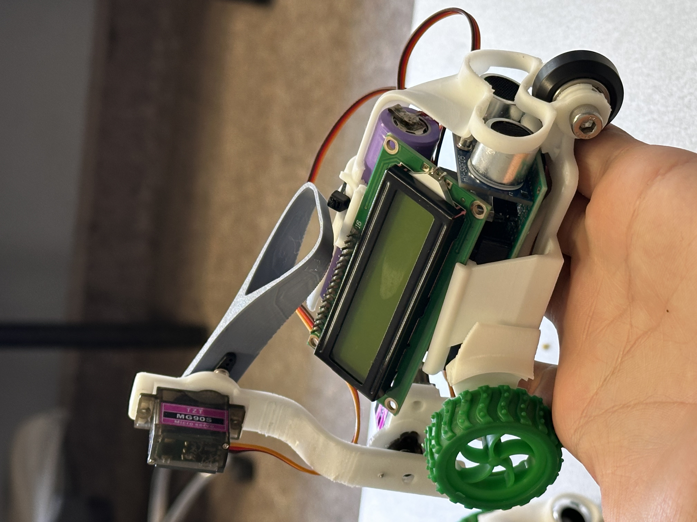
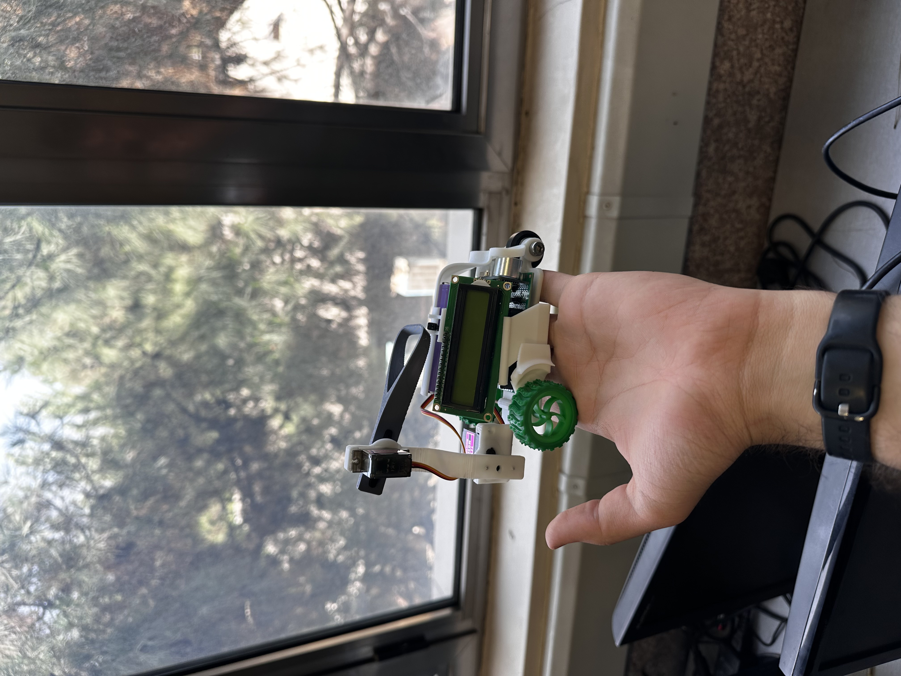
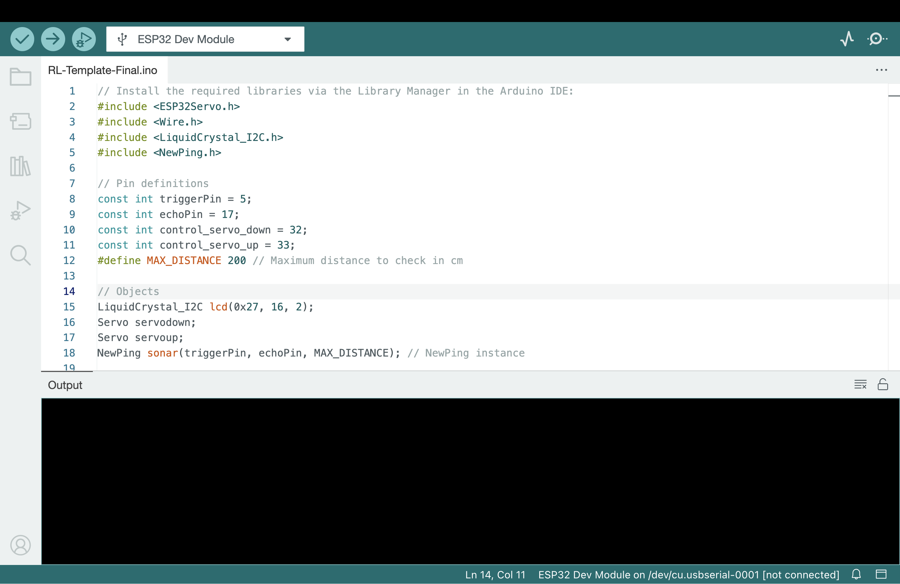

# RL Crawling Robot 🐛

This project features a crawling worm-like robot trained with Reinforcement Learning (Q-Learning) to move forward using a 2-DOF servo-driven arm. It integrates embedded control, 3D mechanical design, and AI logic.

## 🎯 Project Goal

To demonstrate a simple, low-cost robot platform that learns to crawl using reinforcement learning, suitable for education and experimentation.

---

## 🔧 Components

- Arduino Uno
- 2x Servo Motors (TowerPro SG90)
- Custom 3D-printed worm body
- Breadboard, jumper wires
- Power supply

---

## 🧠 RL Algorithm

Implemented basic Q-learning logic in Arduino C++ to control servo positions based on feedback and rewards. The agent receives a reward for successful forward movement and updates its action policy accordingly.

---

## 🛠️ Folder Structure
.
├── code/ ← RL logic (Arduino .ino)
├── models/ ← 3D CAD files (.3dm, .stl)
├── docs/ ← Wiring, assembly, GIF demo
└── README.md ← You are here


---

## 📷 Preview




---

## 🔄 How to Run

1. Clone this repository:
   ```bash
   git clone https://github.com/yourusername/rl-crawling-robot.git

